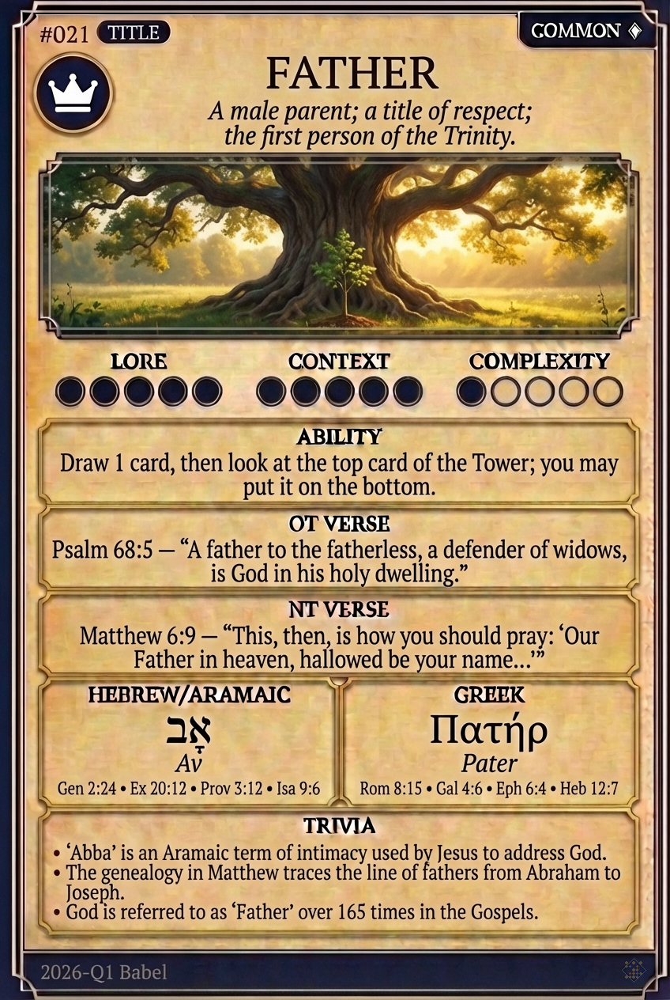

# Hypertext — FATHER

## Word
**FATHER** — A male parent; a title of respect; the first person of the Trinity.

## Old Testament
> Psalm 68:5 — "A father to the fatherless, a defender of widows, is God in his holy dwelling."

## New Testament
> Matthew 6:9 — "This, then, is how you should pray: 'Our Father in heaven, hallowed be your name...'"

## Trivia
- 'Abba' is an Aramaic term of intimacy used by Jesus to address God.
- The genealogy in Matthew traces the line of fathers from Abraham to Joseph.
- God is referred to as 'Father' over 165 times in the Gospels.

