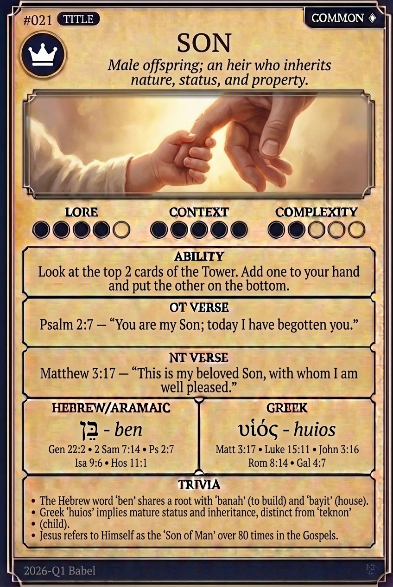

# Hypertext — SON

## Word
**SON** — Male offspring; an heir who inherits nature, status, and property.

## Old Testament
> Psalm 2:7 — "You are my Son; today I have begotten you."

## New Testament
> Matthew 3:17 — "This is my beloved Son, with whom I am well pleased."

## Trivia
- The Hebrew word 'ben' shares a root with 'banah' (to build) and 'bayit' (house).
- Greek 'huios' implies mature status and inheritance, distinct from 'teknon' (child).
- Jesus refers to Himself as the 'Son of Man' over 80 times in the Gospels.

