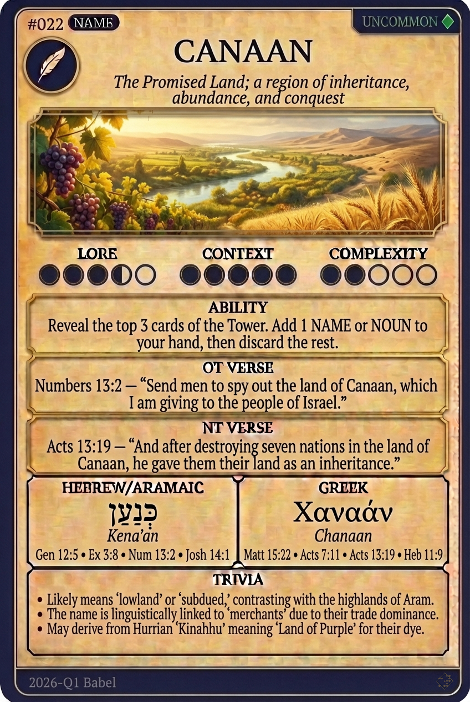

# Hypertext — CANAAN

## Word
**CANAAN** — The Promised Land; a region of inheritance, abundance, and conquest

## Old Testament
> Numbers 13:2 — "Send men to spy out the land of Canaan, which I am giving to the people of Israel."

## New Testament
> Acts 13:19 — "And after destroying seven nations in the land of Canaan, he gave them their land as an inheritance."

## Trivia
- Likely means 'lowland' or 'subdued,' contrasting with the highlands of Aram.
- The name is linguistically linked to 'merchants' due to their trade dominance.
- May derive from Hurrian 'Kinahhu' meaning 'Land of Purple' for their dye.

