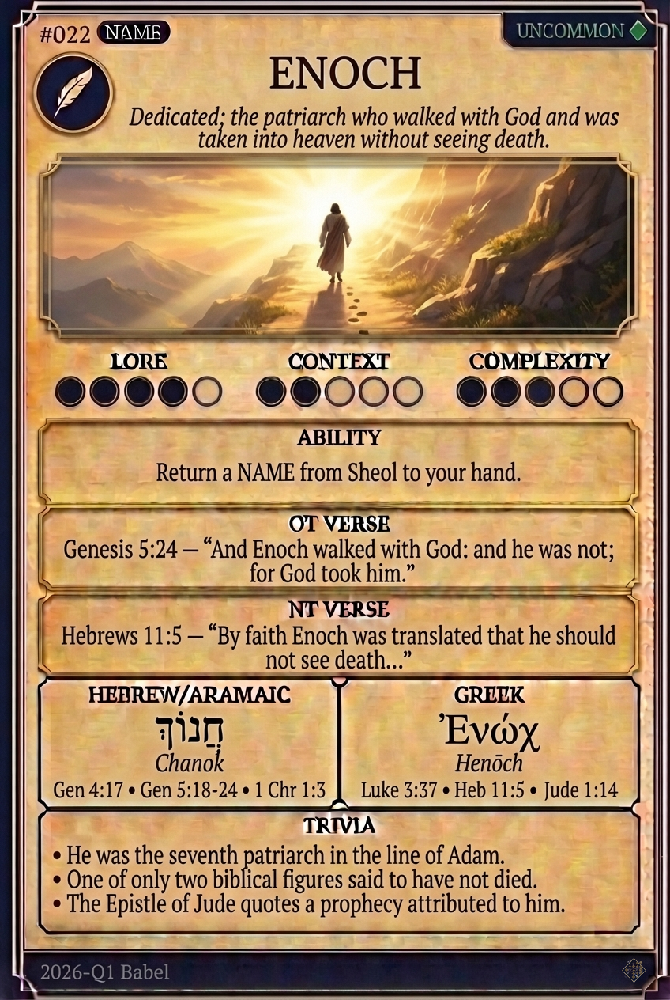

# Hypertext — ENOCH

## Word
**ENOCH** — Dedicated; the patriarch who walked with God and was taken into heaven without seeing death.

## Old Testament
> Genesis 5:24 — "And Enoch walked with God: and he was not; for God took him."

## New Testament
> Hebrews 11:5 — "By faith Enoch was translated that he should not see death..."

## Trivia
- He was the seventh patriarch in the line of Adam.
- One of only two biblical figures said to have not died.
- The Epistle of Jude quotes a prophecy attributed to him.

