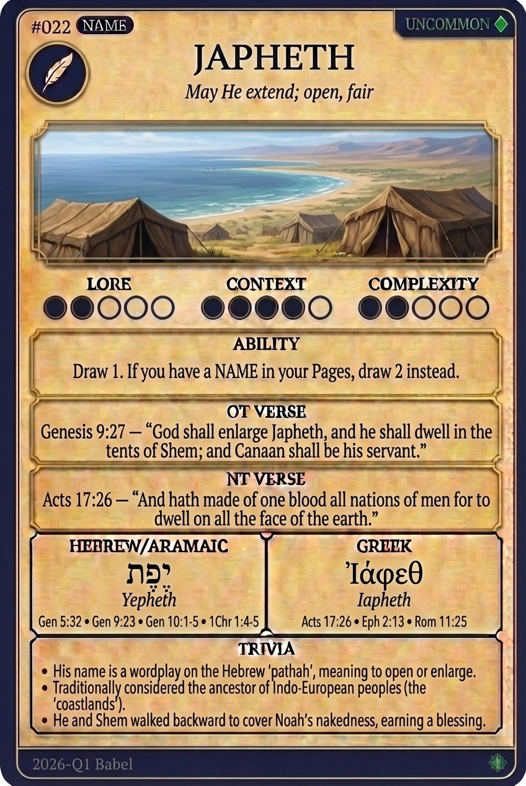

# Hypertext — JAPHETH

## Word
**JAPHETH** — May He extend; open, fair

## Old Testament
> Genesis 9:27 — "God shall enlarge Japheth, and he shall dwell in the tents of Shem; and Canaan shall be his servant."

## New Testament
> Acts 17:26 — "And hath made of one blood all nations of men for to dwell on all the face of the earth."

## Trivia
- His name is a wordplay on the Hebrew 'pathah', meaning to open or enlarge.
- Traditionally considered the ancestor of Indo-European peoples (the 'coastlands').
- He and Shem walked backward to cover Noah's nakedness, earning a blessing.

