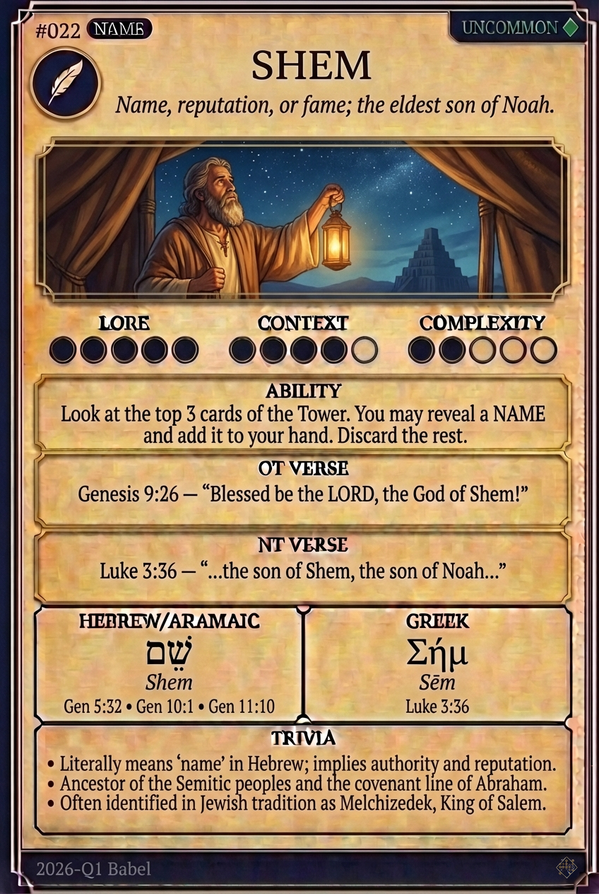

# Hypertext — SHEM

## Word
**SHEM** — Name; the eldest son of Noah, father of the blessed line

## Old Testament
> Genesis 9:26 — "Blessed be the LORD God of Shem; and Canaan shall be his servant"

## New Testament
> Luke 3:36 — "which was the son of Sem, which was the son of Noe"

## Trivia
- Genesis 9:26 blesses the LORD God of Shem rather than Shem himself - the only blessing in the chapter aimed past the man to his God.
- Shem is introduced in Genesis 10:21 as the father of all the children of Eber, four generations before Eber is born in the text.
- The builders at Babel say let us make us a name - shem - two chapters after a man named Shem has been given one.

