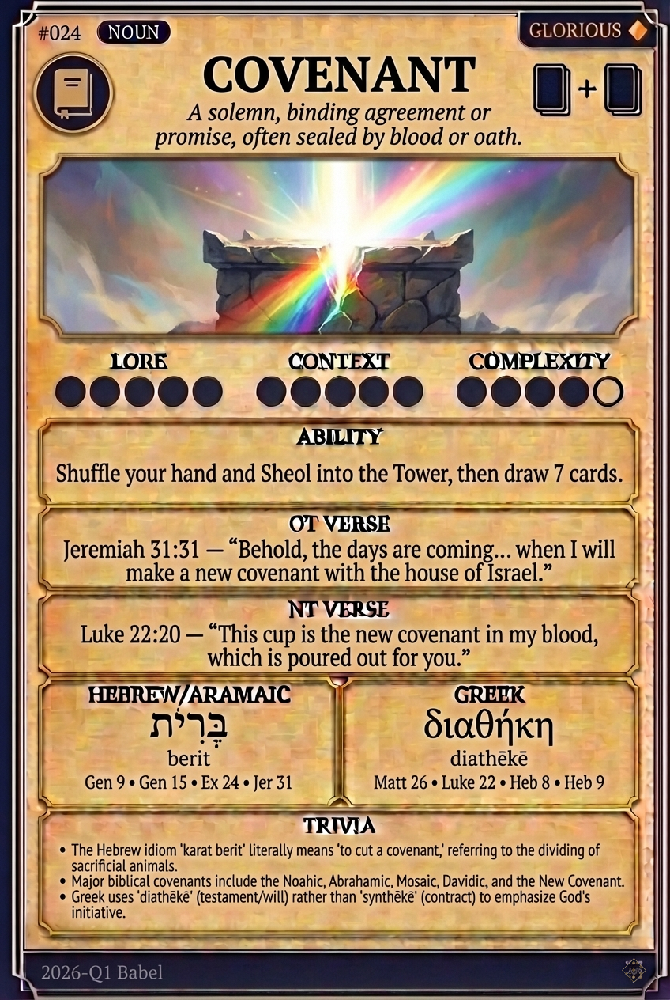

# Hypertext — COVENANT

## Word
**COVENANT** — A solemn, binding agreement or promise, often sealed by blood or oath.

## Old Testament
> Jeremiah 31:31 — "Behold, the days are coming... when I will make a new covenant with the house of Israel."

## New Testament
> Luke 22:20 — "This cup is the new covenant in my blood, which is poured out for you."

## Trivia
- The Hebrew idiom 'karat berit' literally means 'to cut a covenant,' referring to the dividing of sacrificial animals.
- Major biblical covenants include the Noahic, Abrahamic, Mosaic, Davidic, and the New Covenant.
- Greek uses 'diathēkē' (testament/will) rather than 'synthēkē' (contract) to emphasize God's initiative.

