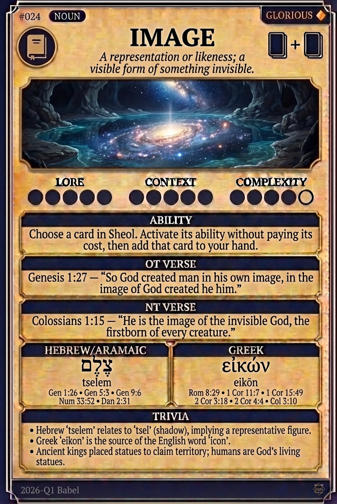

# Hypertext — IMAGE

## Word
**IMAGE** — A representation or likeness; a visible form of something invisible.

## Old Testament
> Genesis 1:27 — "So God created man in his own image, in the image of God created he him."

## New Testament
> Colossians 1:15 — "He is the image of the invisible God, the firstborn of every creature."

## Trivia
- Hebrew 'tselem' relates to 'tsel' (shadow), implying a representative figure.
- Greek 'eikon' is the source of the English word 'icon'.
- Ancient kings placed statues to claim territory; humans are God's living statues.

