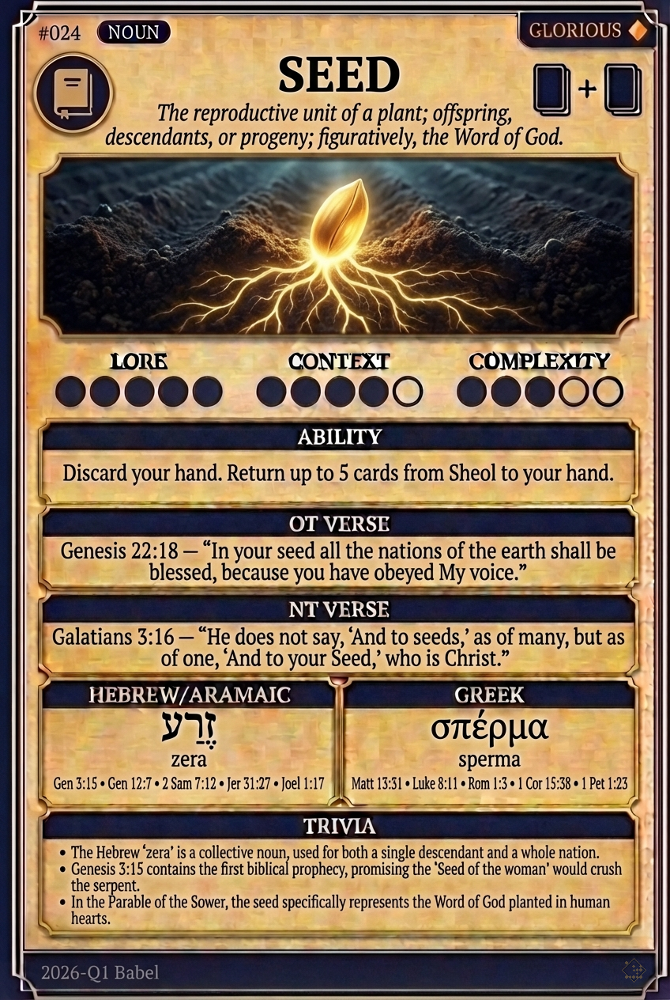

# Hypertext — SEED

## Word
**SEED** — The reproductive unit of a plant; offspring, descendants, or progeny; figuratively, the Word of God.

## Old Testament
> Genesis 22:18 — "In your seed all the nations of the earth shall be blessed, because you have obeyed My voice."

## New Testament
> Galatians 3:16 — "He does not say, 'And to seeds,' as of many, but as of one, 'And to your Seed,' who is Christ."

## Trivia
- The Hebrew 'zera' is a collective noun, used for both a single descendant and a whole nation.
- Genesis 3:15 contains the first biblical prophecy, promising the 'Seed of the woman' would crush the serpent.
- In the Parable of the Sower, the seed specifically represents the Word of God planted in human hearts.

