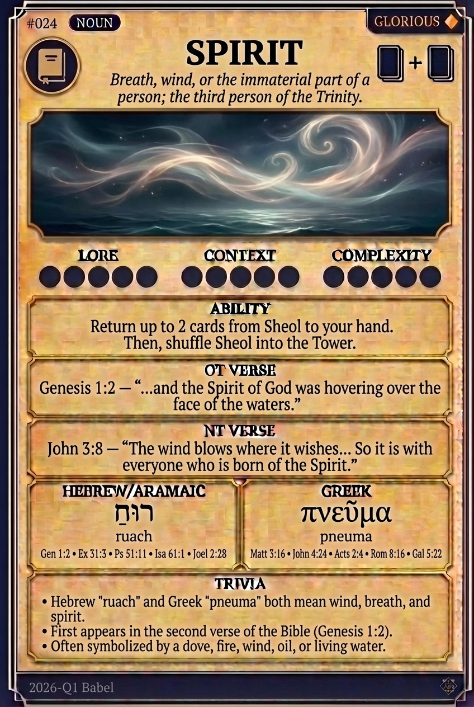

# Hypertext — SPIRIT

## Word
**SPIRIT** — Breath, wind, or the immaterial part of a person; the third person of the Trinity.

## Old Testament
> Genesis 1:2 — "...and the Spirit of God was hovering over the face of the waters."

## New Testament
> John 3:8 — "The wind blows where it wishes... So it is with everyone who is born of the Spirit."

## Trivia
- Hebrew 'ruach' and Greek 'pneuma' both mean wind, breath, and spirit.
- First appears in the second verse of the Bible (Genesis 1:2).
- Often symbolized by a dove, fire, wind, oil, or living water.

