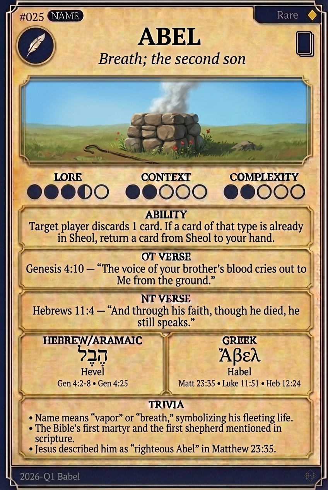

# Hypertext — ABEL

## Word
**ABEL** — Breath; the second son

## Old Testament
> Genesis 4:10 — "The voice of your brother's blood cries out to Me from the ground."

## New Testament
> Hebrews 11:4 — "And through his faith, though he died, he still speaks."

## Trivia
- Name means "vapor" or "breath," symbolizing his fleeting life.
- The Bible's first martyr and the first shepherd mentioned in scripture.
- Jesus described him as "righteous Abel" in Matthew 23:35.

