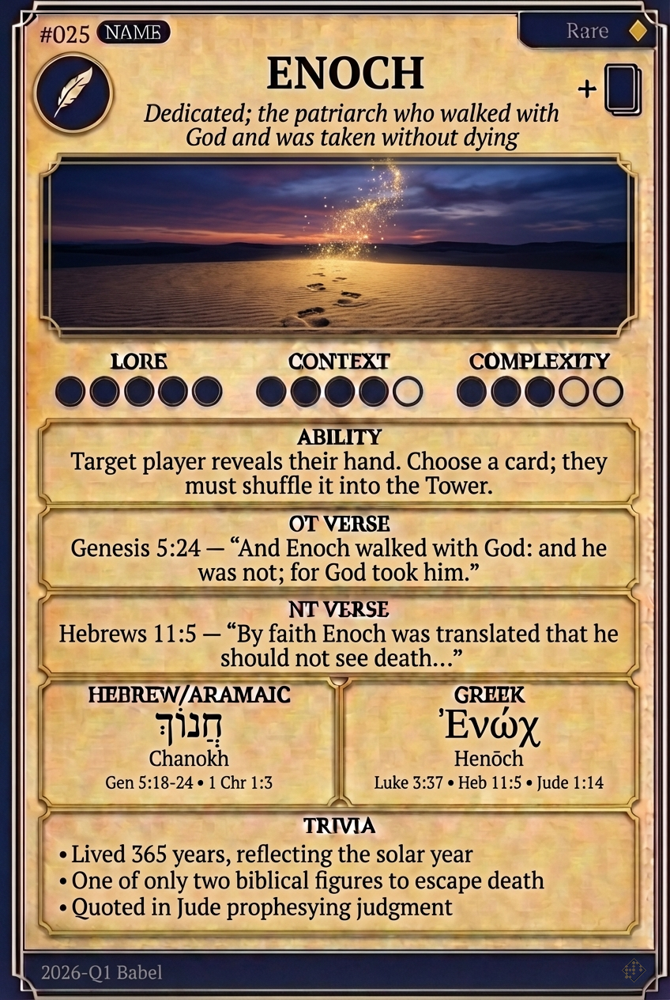

# Hypertext — ENOCH

## Word
**ENOCH** — Dedicated; the patriarch who walked with God and was taken without dying

## Old Testament
> Genesis 5:24 — "And Enoch walked with God: and he was not; for God took him."

## New Testament
> Hebrews 11:5 — "By faith Enoch was translated that he should not see death..."

## Trivia
- Lived 365 years, reflecting the solar year
- One of only two biblical figures to escape death
- Quoted in Jude prophesying judgment

