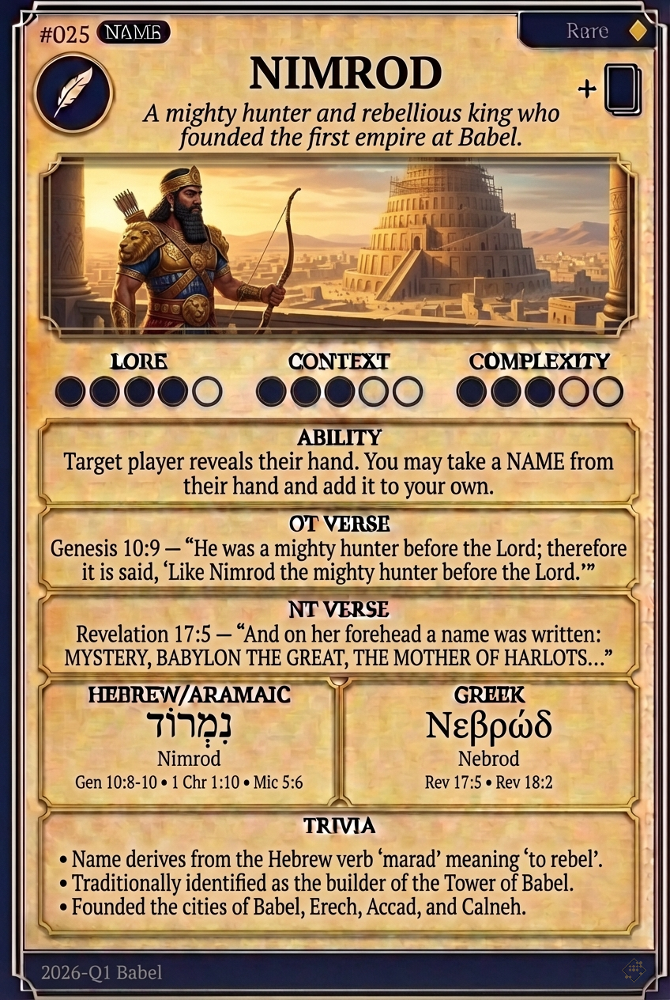

# Hypertext — NIMROD

## Word
**NIMROD** — A mighty hunter and rebellious king who founded the first empire at Babel.

## Old Testament
> Genesis 10:9 — "He was a mighty hunter before the Lord; therefore it is said, 'Like Nimrod the mighty hunter before the Lord.'"

## New Testament
> Revelation 17:5 — "And on her forehead a name was written: MYSTERY, BABYLON THE GREAT, THE MOTHER OF HARLOTS..."

## Trivia
- Name derives from the Hebrew verb 'marad' meaning 'to rebel'.
- Traditionally identified as the builder of the Tower of Babel.
- Founded the cities of Babel, Erech, Accad, and Calneh.

