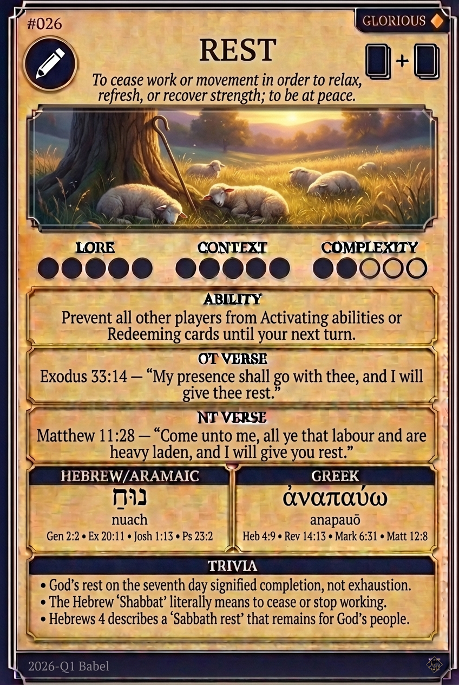

# Hypertext — REST

## Word
**REST** — To cease work or movement in order to relax, refresh, or recover strength; to be at peace.

## Old Testament
> Exodus 33:14 — "My presence shall go with thee, and I will give thee rest."

## New Testament
> Matthew 11:28 — "Come unto me, all ye that labour and are heavy laden, and I will give you rest."

## Trivia
- God's rest on the seventh day signified completion, not exhaustion.
- The Hebrew 'Shabbat' literally means to cease or stop working.
- Hebrews 4 describes a 'Sabbath rest' that remains for God's people.

