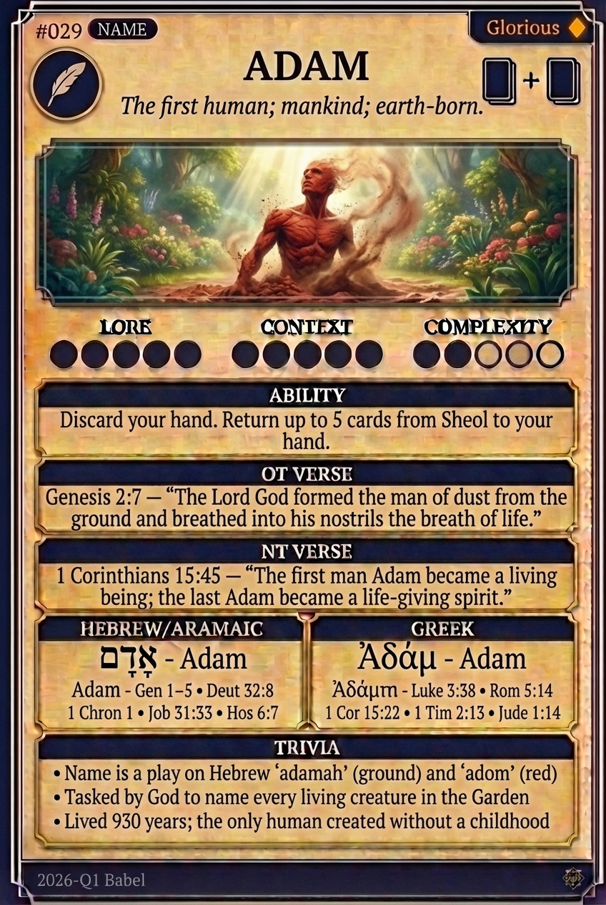

# Hypertext — ADAM

## Word
**ADAM** — The first human; mankind; earth-born.

## Old Testament
> Genesis 2:7 — "The Lord God formed the man of dust from the ground and breathed into his nostrils the breath of life."

## New Testament
> 1 Corinthians 15:45 — "The first man Adam became a living being; the last Adam became a life-giving spirit."

## Trivia
- Name is a play on Hebrew 'adamah' (ground) and 'adom' (red)
- Tasked by God to name every living creature in the Garden
- Lived 930 years; the only human created without a childhood

