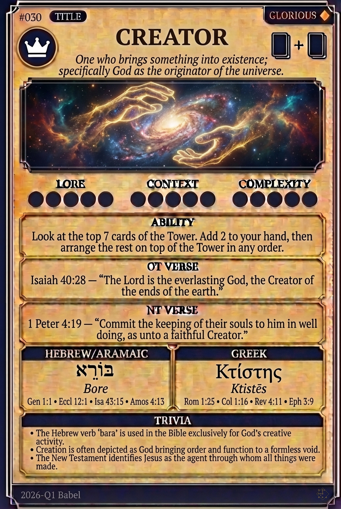

# Hypertext — CREATOR

## Word
**CREATOR** — One who brings something into existence; specifically God as the originator of the universe.

## Old Testament
> Isaiah 40:28 — "The Lord is the everlasting God, the Creator of the ends of the earth."

## New Testament
> 1 Peter 4:19 — "Commit the keeping of their souls to him in well doing, as unto a faithful Creator."

## Trivia
- The Hebrew verb 'bara' is used in the Bible exclusively for God's creative activity.
- Creation is often depicted as God bringing order and function to a formless void.
- The New Testament identifies Jesus as the agent through whom all things were made.

