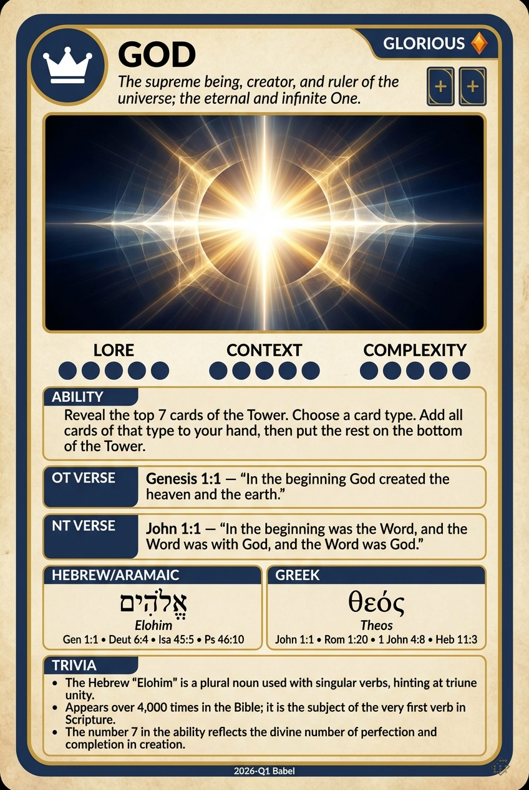

# Hypertext — GOD

## Word
**GOD** — The supreme being, creator, and ruler of the universe; the eternal and infinite One.

## Old Testament
> Genesis 1:1 — "In the beginning God created the heaven and the earth."

## New Testament
> John 1:1 — "In the beginning was the Word, and the Word was with God, and the Word was God."

## Trivia
- The Hebrew 'Elohim' is a plural noun used with singular verbs, hinting at triune unity.
- Appears over 4,000 times in the Bible; it is the subject of the very first verb in Scripture.
- The number 7 in the ability reflects the divine number of perfection and completion in creation.

