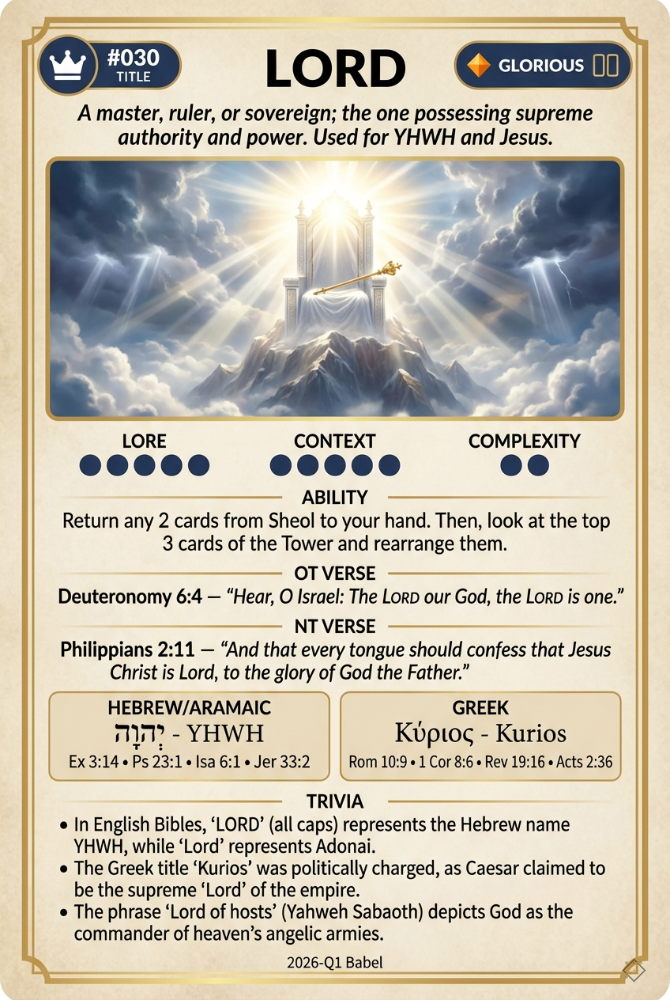

# Hypertext — LORD

## Word
**LORD** — A master, ruler, or sovereign; the one possessing supreme authority and power. Used for YHWH and Jesus.

## Old Testament
> Deuteronomy 6:4 — "Hear, O Israel: The LORD our God, the LORD is one."

## New Testament
> Philippians 2:11 — "And that every tongue should confess that Jesus Christ is Lord, to the glory of God the Father."

## Trivia
- In English Bibles, 'LORD' (all caps) represents the Hebrew name YHWH, while 'Lord' represents Adonai.
- The Greek title 'Kurios' was politically charged, as Caesar claimed to be the supreme 'Lord' of the empire.
- The phrase 'Lord of hosts' (Yahweh Sabaoth) depicts God as the commander of heaven's angelic armies.

