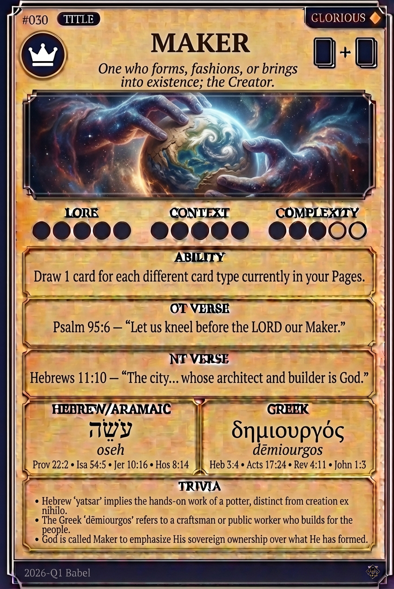

# Hypertext — MAKER

## Word
**MAKER** — One who forms, fashions, or brings into existence; the Creator.

## Old Testament
> Psalm 95:6 — "Let us kneel before the LORD our Maker."

## New Testament
> Hebrews 11:10 — "The city... whose architect and builder is God."

## Trivia
- Hebrew 'yatsar' implies the hands-on work of a potter, distinct from creation ex nihilo.
- The Greek 'dēmiourgos' refers to a craftsman or public worker who builds for the people.
- God is called Maker to emphasize His sovereign ownership over what He has formed.

