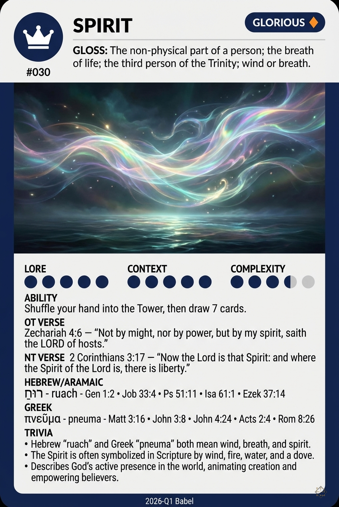

# Hypertext — SPIRIT

## Word
**SPIRIT** — The non-physical part of a person; the breath of life; the third person of the Trinity; wind or breath.

## Old Testament
> Zechariah 4:6 — "Not by might, nor by power, but by my spirit, saith the LORD of hosts."

## New Testament
> 2 Corinthians 3:17 — "Now the Lord is that Spirit: and where the Spirit of the Lord is, there is liberty."

## Trivia
- Hebrew 'ruach' and Greek 'pneuma' both mean wind, breath, and spirit.
- The Spirit is often symbolized in Scripture by wind, fire, water, and a dove.
- Describes God's active presence in the world, animating creation and empowering believers.

