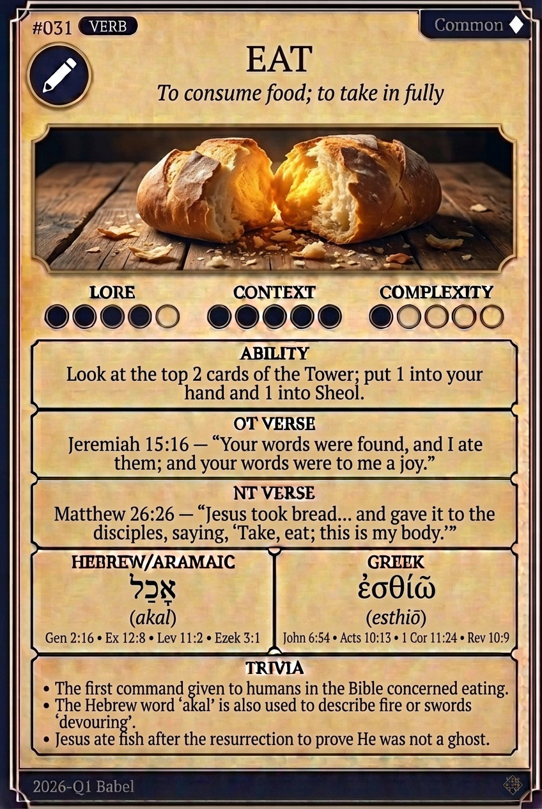

# Hypertext — EAT

## Word
**EAT** — To consume food; to take in fully

## Old Testament
> Jeremiah 15:16 — "Your words were found, and I ate them; and your words were to me a joy."

## New Testament
> Matthew 26:26 — "Jesus took bread... and gave it to the disciples, saying, 'Take, eat; this is my body.'"

## Trivia
- The first command given to humans in the Bible concerned eating.
- The Hebrew word 'akal' is also used to describe fire or swords 'devouring'.
- Jesus ate fish after the resurrection to prove He was not a ghost.

