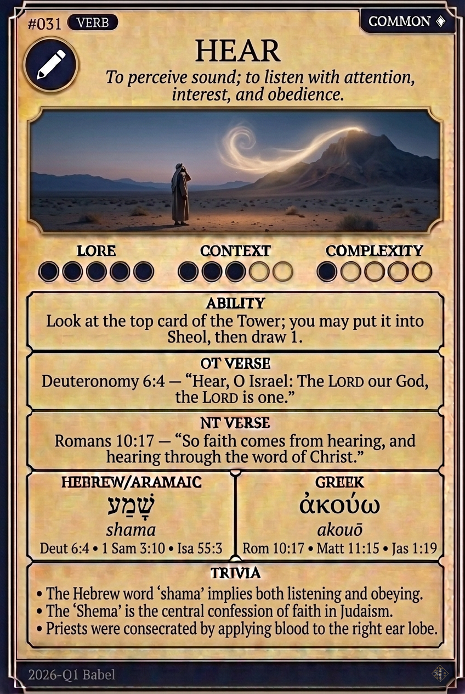

# Hypertext — HEAR

## Word
**HEAR** — To perceive a voice and attend to it

## Old Testament
> Genesis 3:8 — "And they heard the voice of the LORD God walking in the garden in the cool of the day"

## New Testament
> John 10:27 — "My sheep hear my voice, and I know them, and they follow me"

## Trivia
- The first thing the man and the woman do after eating is hear - the sound of God walking in the garden sends them into the trees.
- Hebrew has no separate verb for obey; to hear a command and to keep it are the same word, which is why the KJV writes hearken.
- The Shema takes its name from its first word, shema - Hear, O Israel.

