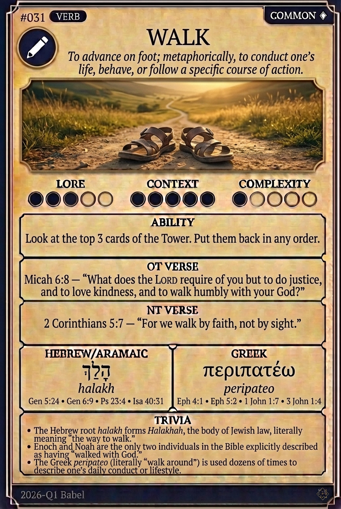

# Hypertext — WALK

## Word
**WALK** — To advance on foot; metaphorically, to conduct one's life, behave, or follow a specific course of action.

## Old Testament
> Micah 6:8 — "What does the LORD require of you but to do justice, and to love kindness, and to walk humbly with your God?"

## New Testament
> 2 Corinthians 5:7 — "For we walk by faith, not by sight."

## Trivia
- The Hebrew root *halakh* forms *Halakhah*, the body of Jewish law, literally meaning "the way to walk."
- Enoch and Noah are the only two individuals in the Bible explicitly described as having "walked with God."
- The Greek *peripateo* (literally "walk around") is used dozens of times to describe one's daily conduct or lifestyle.

