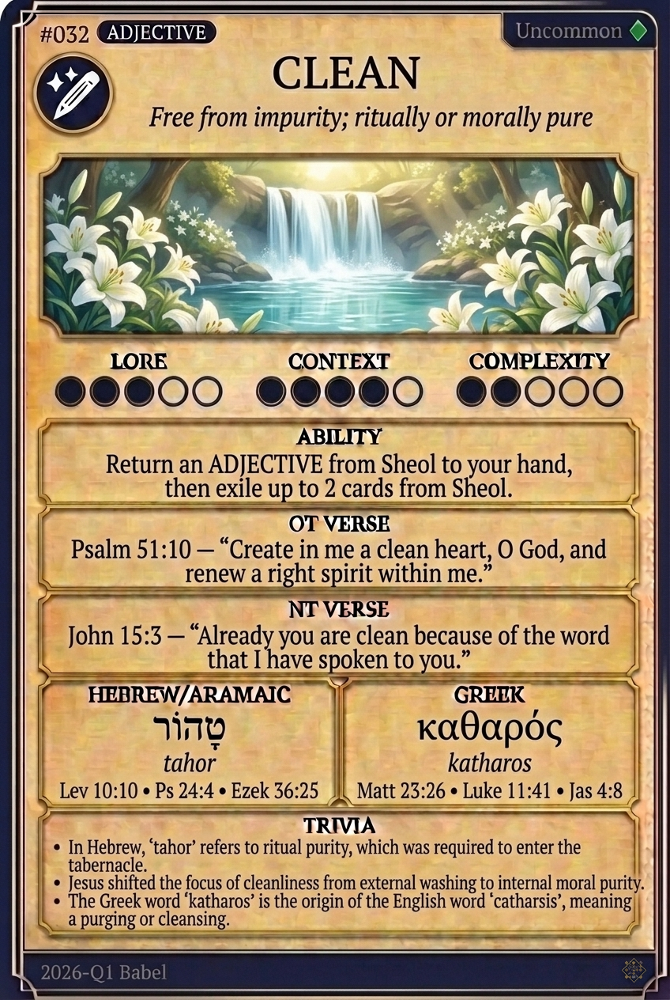

# Hypertext — CLEAN

## Word
**CLEAN** — Free from impurity; ritually or morally pure

## Old Testament
> Psalm 51:10 — "Create in me a clean heart, O God, and renew a right spirit within me."

## New Testament
> John 15:3 — "Already you are clean because of the word that I have spoken to you."

## Trivia
- In Hebrew, 'tahor' refers to ritual purity, which was required to enter the tabernacle.
- Jesus shifted the focus of cleanliness from external washing to internal moral purity.
- The Greek word 'katharos' is the origin of the English word 'catharsis', meaning a purging or cleansing.

