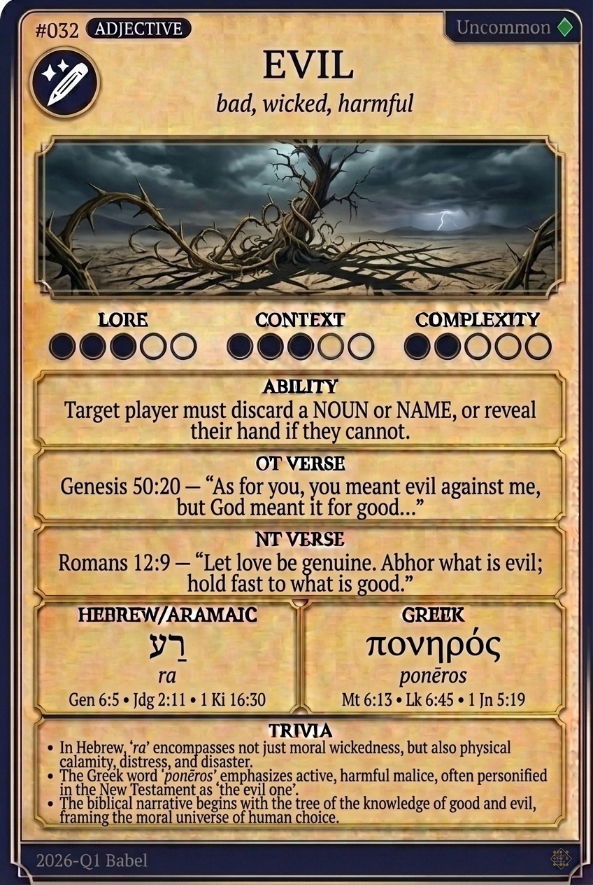

# Hypertext — EVIL

## Word
**EVIL** — bad, wicked, harmful

## Old Testament
> Genesis 50:20 — "As for you, you meant evil against me, but God meant it for good..."

## New Testament
> Romans 12:9 — "Let love be genuine. Abhor what is evil; hold fast to what is good."

## Trivia
- In Hebrew, 'ra' encompasses not just moral wickedness, but also physical calamity, distress, and disaster.
- The Greek word 'ponēros' emphasizes active, harmful malice, often personified in the New Testament as 'the evil one'.
- The biblical narrative begins with the tree of the knowledge of good and evil, framing the moral universe of human choice.

