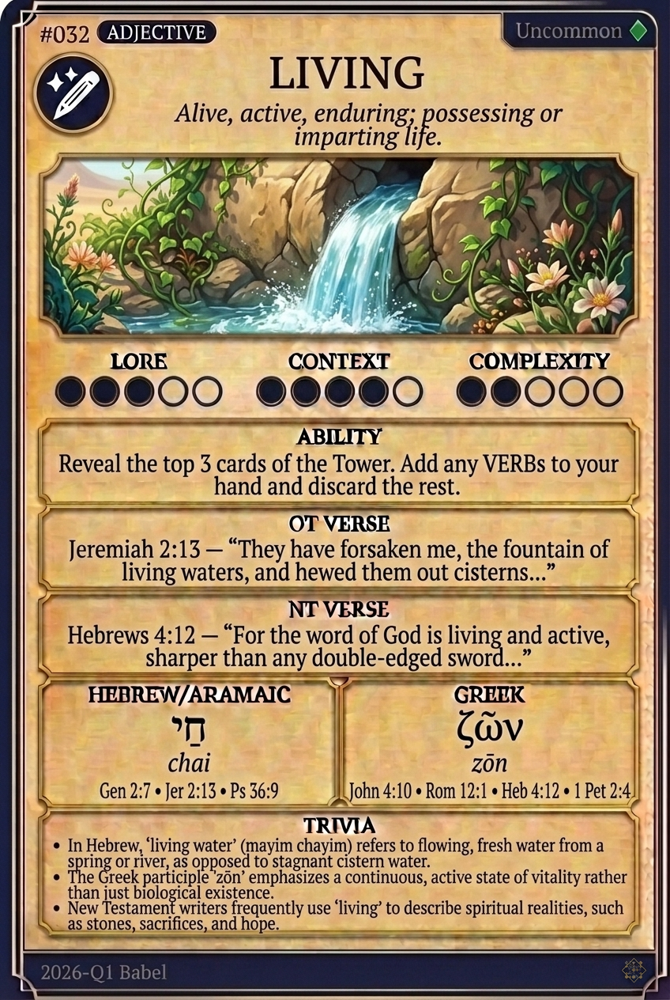

# Hypertext — LIVING

## Word
**LIVING** — Alive, active, enduring; possessing or imparting life.

## Old Testament
> Jeremiah 2:13 — "They have forsaken me, the fountain of living waters, and hewed them out cisterns..."

## New Testament
> Hebrews 4:12 — "For the word of God is living and active, sharper than any double-edged sword..."

## Trivia
- In Hebrew, 'living water' (mayim chayim) refers to flowing, fresh water from a spring or river, as opposed to stagnant cistern water.
- The Greek participle 'zōn' emphasizes a continuous, active state of vitality rather than just biological existence.
- New Testament writers frequently use 'living' to describe spiritual realities, such as stones, sacrifices, and hope.

