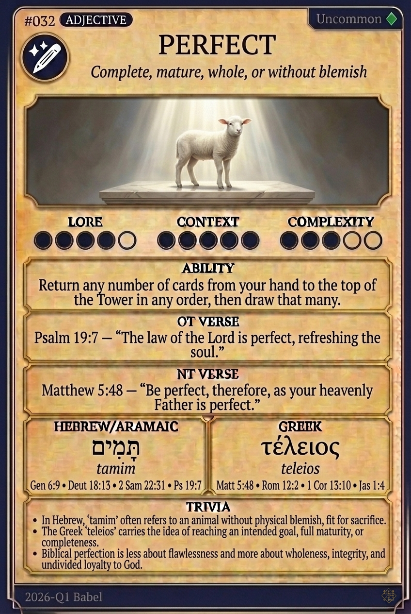

# Hypertext — PERFECT

## Word
**PERFECT** — Complete, mature, whole, or without blemish

## Old Testament
> Psalm 19:7 — "The law of the Lord is perfect, refreshing the soul."

## New Testament
> Matthew 5:48 — "Be perfect, therefore, as your heavenly Father is perfect."

## Trivia
- In Hebrew, 'tamim' often refers to an animal without physical blemish, fit for sacrifice.
- The Greek 'teleios' carries the idea of reaching an intended goal, full maturity, or completeness.
- Biblical perfection is less about flawlessness and more about wholeness, integrity, and undivided loyalty to God.

