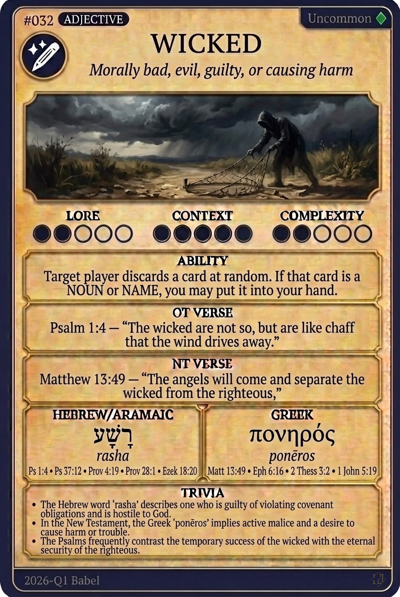

# Hypertext — WICKED

## Word
**WICKED** — Morally bad, evil, guilty, or causing harm

## Old Testament
> Psalm 1:4 — "The wicked are not so, but are like chaff that the wind drives away."

## New Testament
> Matthew 13:49 — "The angels will come and separate the wicked from the righteous,"

## Trivia
- The Hebrew word 'rasha' describes one who is guilty of violating covenant obligations and is hostile to God.
- In the New Testament, the Greek 'ponēros' implies active malice and a desire to cause harm or trouble.
- The Psalms frequently contrast the temporary success of the wicked with the eternal security of the righteous.

