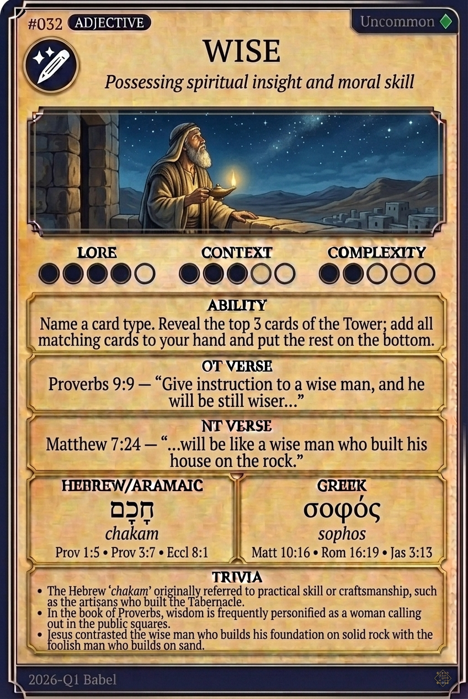

# Hypertext — WISE

## Word
**WISE** — Possessing spiritual insight and moral skill

## Old Testament
> Proverbs 9:9 — "Give instruction to a wise man, and he will be still wiser..."

## New Testament
> Matthew 7:24 — "...will be like a wise man who built his house on the rock."

## Trivia
- The Hebrew 'chakam' originally referred to practical skill or craftsmanship, such as the artisans who built the Tabernacle.
- In the book of Proverbs, wisdom is frequently personified as a woman calling out in the public squares.
- Jesus contrasted the wise man who builds his foundation on solid rock with the foolish man who builds on sand.

