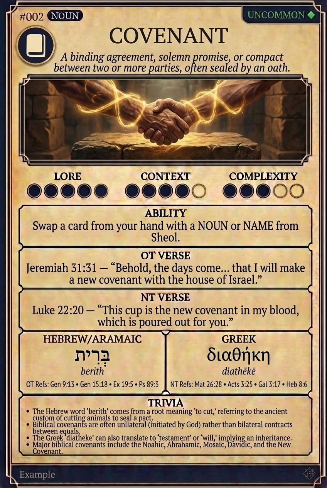

# Hypertext — COVENANT

## Word
**COVENANT** — A binding agreement, solemn promise, or compact between two or more parties, often sealed by an oath.

## Old Testament
> Jeremiah 31:31 — "Behold, the days come... that I will make a new covenant with the house of Israel."

## New Testament
> Luke 22:20 — "This cup is the new covenant in my blood, which is poured out for you."

## Trivia
- The Hebrew word 'berith' comes from a root meaning 'to cut,' referring to the ancient custom of cutting animals to seal a pact.
- Biblical covenants are often unilateral (initiated by God) rather than bilateral contracts between equals.
- The Greek 'diatheke' can also translate to 'testament' or 'will,' implying an inheritance.
- Major biblical covenants include the Noahic, Abrahamic, Mosaic, Davidic, and the New Covenant.

