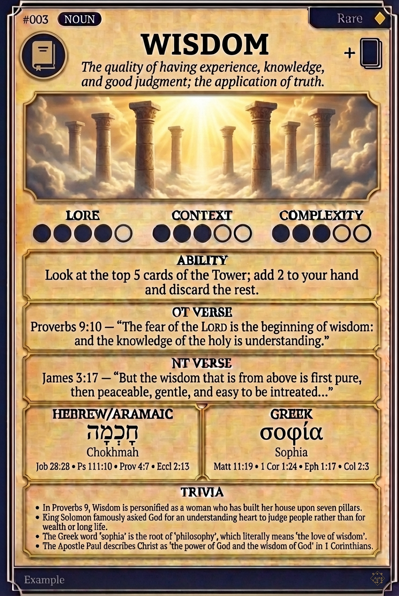

# Hypertext — WISDOM

## Word
**WISDOM** — The quality of having experience, knowledge, and good judgment; the application of truth.

## Old Testament
> Proverbs 9:10 — "The fear of the LORD is the beginning of wisdom: and the knowledge of the holy is understanding."

## New Testament
> James 3:17 — "But the wisdom that is from above is first pure, then peaceable, gentle, and easy to be intreated..."

## Trivia
- In Proverbs 9, Wisdom is personified as a woman who has built her house upon seven pillars.
- King Solomon famously asked God for an understanding heart to judge people rather than for wealth or long life.
- The Greek word 'sophia' is the root of 'philosophy', which literally means 'the love of wisdom'.
- The Apostle Paul describes Christ as 'the power of God and the wisdom of God' in 1 Corinthians.

