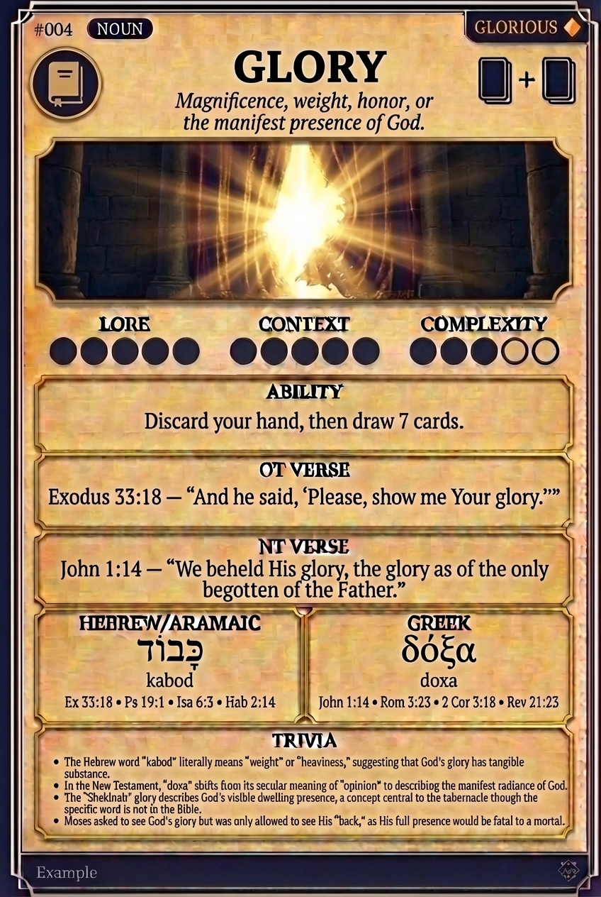

# Hypertext — GLORY

## Word
**GLORY** — Magnificence, weight, honor, or the manifest presence of God.

## Old Testament
> Exodus 33:18 — "And he said, 'Please, show me Your glory.'"

## New Testament
> John 1:14 — "We beheld His glory, the glory as of the only begotten of the Father."

## Trivia
- The Hebrew word 'kabod' literally means 'weight' or 'heaviness,' suggesting that God's glory has tangible substance.
- In the New Testament, 'doxa' shifts from its secular meaning of 'opinion' to describing the manifest radiance of God.
- The 'Shekinah' glory describes God's visible dwelling presence, a concept central to the tabernacle though the specific word is not in the Bible.
- Moses asked to see God's glory but was only allowed to see His 'back,' as His full presence would be fatal to a mortal.

