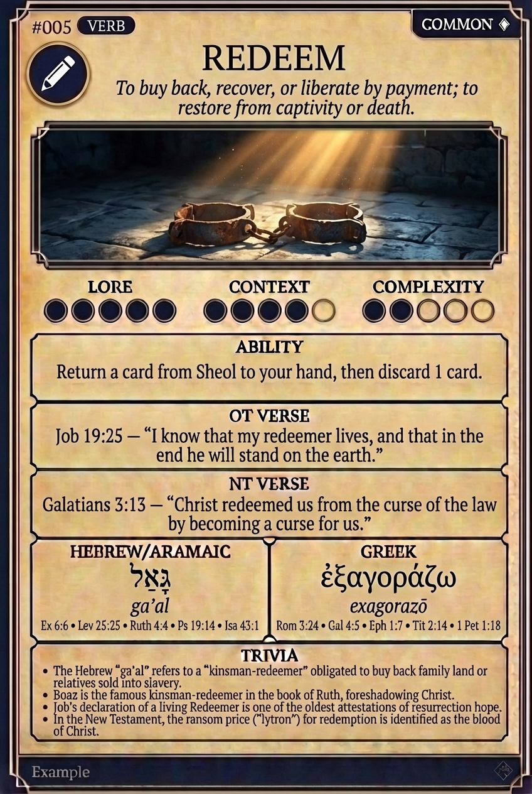

# Hypertext — REDEEM

## Word
**REDEEM** — To buy back, recover, or liberate by payment; to restore from captivity or death.

## Old Testament
> Job 19:25 — "I know that my redeemer lives, and that in the end he will stand on the earth."

## New Testament
> Galatians 3:13 — "Christ redeemed us from the curse of the law by becoming a curse for us."

## Trivia
- The Hebrew 'ga'al' refers to a 'kinsman-redeemer' obligated to buy back family land or relatives sold into slavery.
- Boaz is the famous kinsman-redeemer in the book of Ruth, foreshadowing Christ.
- Job's declaration of a living Redeemer is one of the oldest attestations of resurrection hope.
- In the New Testament, the ransom price ('lytron') for redemption is identified as the blood of Christ.

