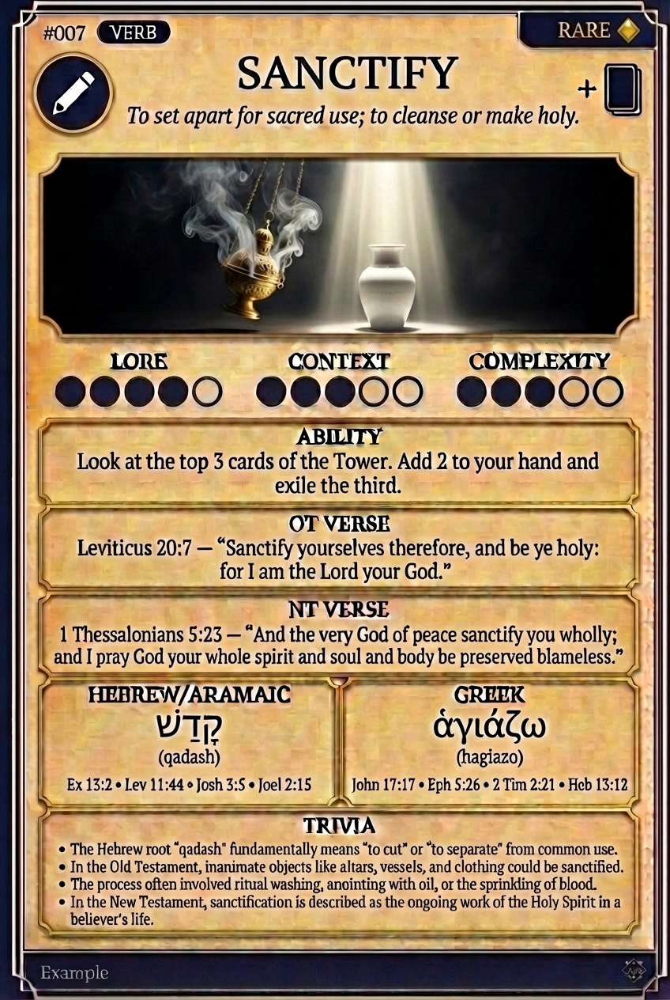

# Hypertext — SANCTIFY

## Word
**SANCTIFY** — To set apart for sacred use; to cleanse or make holy.

## Old Testament
> Leviticus 20:7 — "Sanctify yourselves therefore, and be ye holy: for I am the Lord your God."

## New Testament
> 1 Thessalonians 5:23 — "And the very God of peace sanctify you wholly; and I pray God your whole spirit and soul and body be preserved blameless."

## Trivia
- The Hebrew root 'qadash' fundamentally means 'to cut' or 'to separate' from common use.
- In the Old Testament, inanimate objects like altars, vessels, and clothing could be sanctified.
- The process often involved ritual washing, anointing with oil, or the sprinkling of blood.
- In the New Testament, sanctification is described as the ongoing work of the Holy Spirit in a believer's life.

