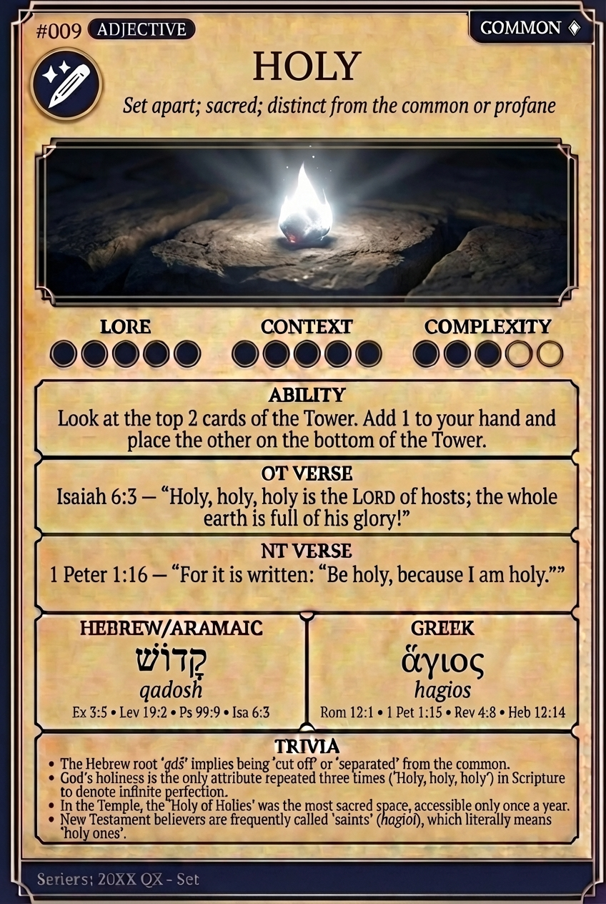

# Hypertext — HOLY

## Word
**HOLY** — Set apart; sacred; distinct from the common or profane

## Old Testament
> Isaiah 6:3 — "Holy, holy, holy is the LORD of hosts; the whole earth is full of his glory!"

## New Testament
> 1 Peter 1:16 — "For it is written: “Be holy, because I am holy.”"

## Trivia
- The Hebrew root 'qdš' implies being 'cut off' or 'separated' from the common.
- God's holiness is the only attribute repeated three times ('Holy, holy, holy') in Scripture to denote infinite perfection.
- In the Temple, the 'Holy of Holies' was the most sacred space, accessible only once a year.
- New Testament believers are frequently called 'saints' (hagioi), which literally means 'holy ones'.

