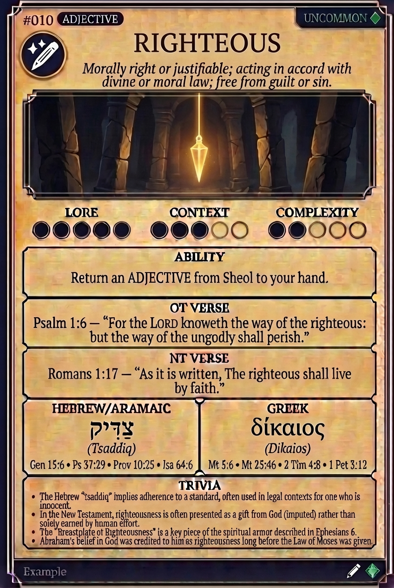

# Hypertext — RIGHTEOUS

## Word
**RIGHTEOUS** — Morally right or justifiable; acting in accord with divine or moral law; free from guilt or sin.

## Old Testament
> Psalm 1:6 — "For the LORD knoweth the way of the righteous: but the way of the ungodly shall perish."

## New Testament
> Romans 1:17 — "As it is written, The righteous shall live by faith."

## Trivia
- The Hebrew 'tsaddiq' implies adherence to a standard, often used in legal contexts for one who is innocent.
- In the New Testament, righteousness is often presented as a gift from God (imputed) rather than solely earned by human effort.
- The 'Breastplate of Righteousness' is a key piece of the spiritual armor described in Ephesians 6.
- Abraham's belief in God was credited to him as righteousness long before the Law of Moses was given.

