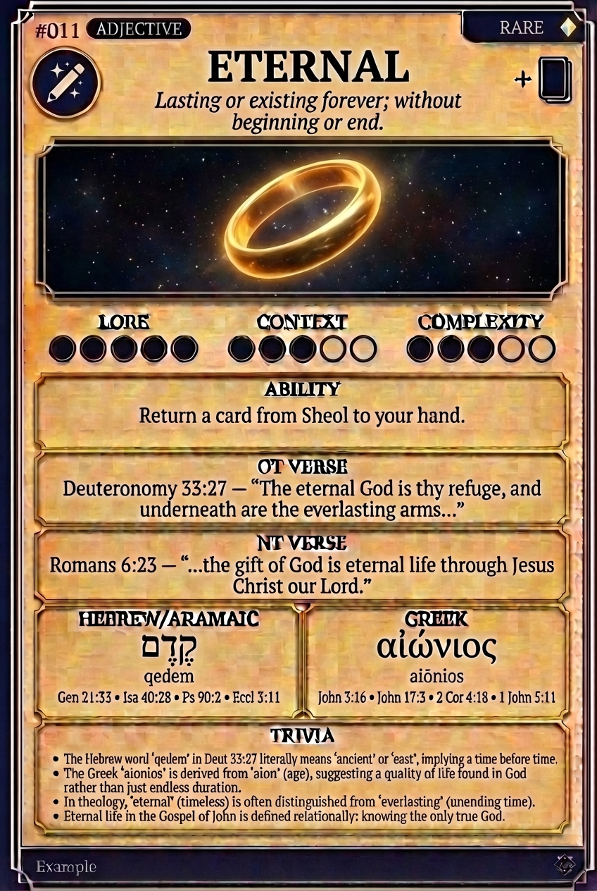

# Hypertext — ETERNAL

## Word
**ETERNAL** — Lasting or existing forever; without beginning or end.

## Old Testament
> Deuteronomy 33:27 — "The eternal God is thy refuge, and underneath are the everlasting arms..."

## New Testament
> Romans 6:23 — "...the gift of God is eternal life through Jesus Christ our Lord."

## Trivia
- The Hebrew word 'qedem' in Deut 33:27 literally means 'ancient' or 'east', implying a time before time.
- The Greek 'aionios' is derived from 'aion' (age), suggesting a quality of life found in God rather than just endless duration.
- In theology, 'eternal' (timeless) is often distinguished from 'everlasting' (unending time).
- Eternal life in the Gospel of John is defined relationally: knowing the only true God.

