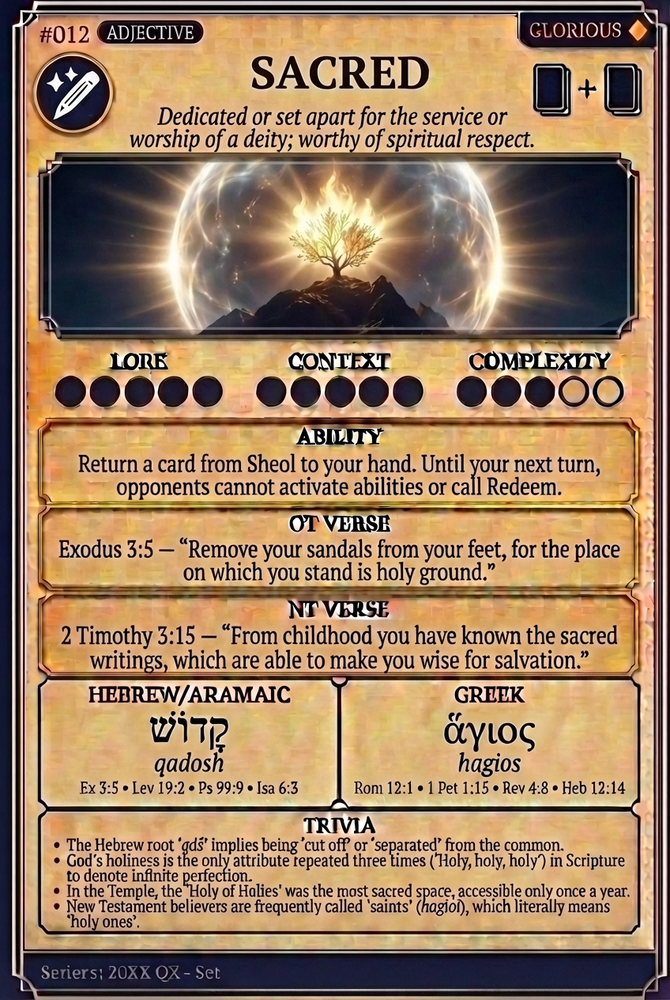

# Hypertext — SACRED

## Word
**SACRED** — Dedicated or set apart for the service or worship of a deity; worthy of spiritual respect.

## Old Testament
> Exodus 3:5 — "Remove your sandals from your feet, for the place on which you stand is holy ground."

## New Testament
> 2 Timothy 3:15 — "From childhood you have known the sacred writings, which are able to make you wise for salvation."

## Trivia
- Derived from the Latin 'sacer', meaning 'set apart' or 'consecrated'.
- In Greek, 'hieros' refers to sacred things (like the temple), while 'hagios' refers to a holy nature.
- The Hebrew 'qadosh' implies a separation from the common or profane.
- Ancient temples were often called 'hieron' (sacred place) to distinguish them from common ground.

