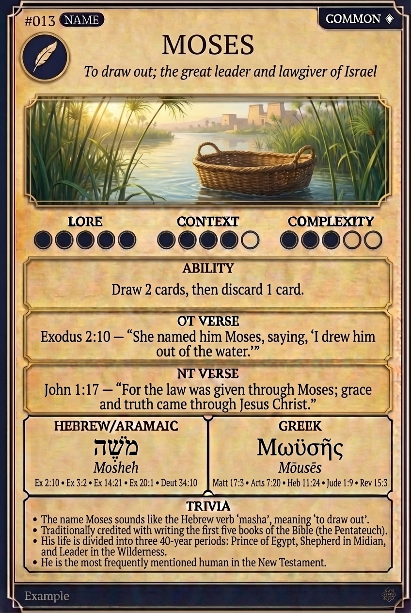

# Hypertext — MOSES

## Word
**MOSES** — To draw out; the great leader and lawgiver of Israel

## Old Testament
> Exodus 2:10 — "She named him Moses, saying, 'I drew him out of the water.'"

## New Testament
> John 1:17 — "For the law was given through Moses; grace and truth came through Jesus Christ."

## Trivia
- The name Moses sounds like the Hebrew verb 'masha', meaning 'to draw out'.
- Traditionally credited with writing the first five books of the Bible (the Pentateuch).
- His life is divided into three 40-year periods: Prince of Egypt, Shepherd in Midian, and Leader in the Wilderness.
- He is the most frequently mentioned human in the New Testament.

