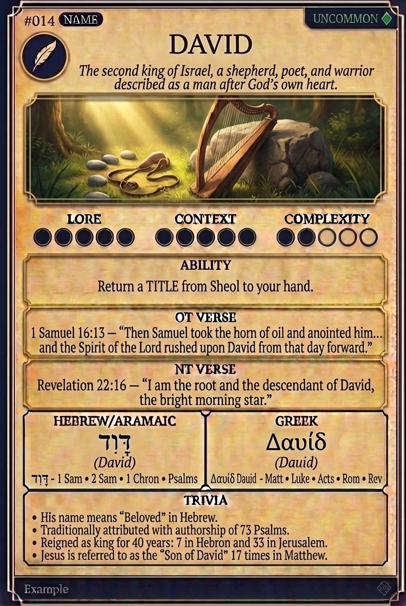

# Hypertext — DAVID

## Word
**DAVID** — The second king of Israel, a shepherd, poet, and warrior described as a man after God's own heart.

## Old Testament
> 1 Samuel 16:13 — "Then Samuel took the horn of oil and anointed him... and the Spirit of the Lord rushed upon David from that day forward."

## New Testament
> Revelation 22:16 — "I am the root and the descendant of David, the bright morning star."

## Trivia
- His name means 'Beloved' in Hebrew.
- Traditionally attributed with authorship of 73 Psalms.
- Reigned as king for 40 years: 7 in Hebron and 33 in Jerusalem.
- Jesus is referred to as the 'Son of David' 17 times in Matthew.

