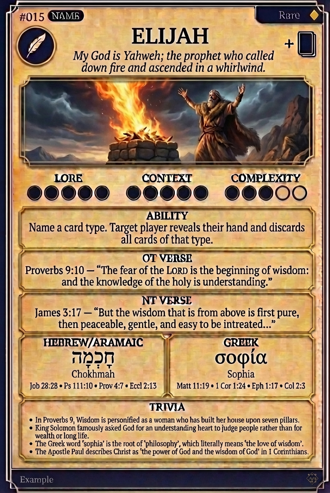

# Hypertext — ELIJAH

## Word
**ELIJAH** — My God is Yahweh; the prophet who called down fire and ascended in a whirlwind.

## Old Testament
> 1 Kings 18:39 — "And when all the people saw it, they fell on their faces: and they said, The LORD, he is the God."

## New Testament
> Matthew 17:3 — "And, behold, there appeared unto them Moses and Elijah talking with him."

## Trivia
- Name means 'My God is Yahweh'.
- Challenged 450 prophets of Baal to a contest by fire on Mount Carmel.
- Taken up to heaven in a whirlwind, one of only two men never to die.
- Appeared alongside Moses at the Transfiguration of Jesus.

