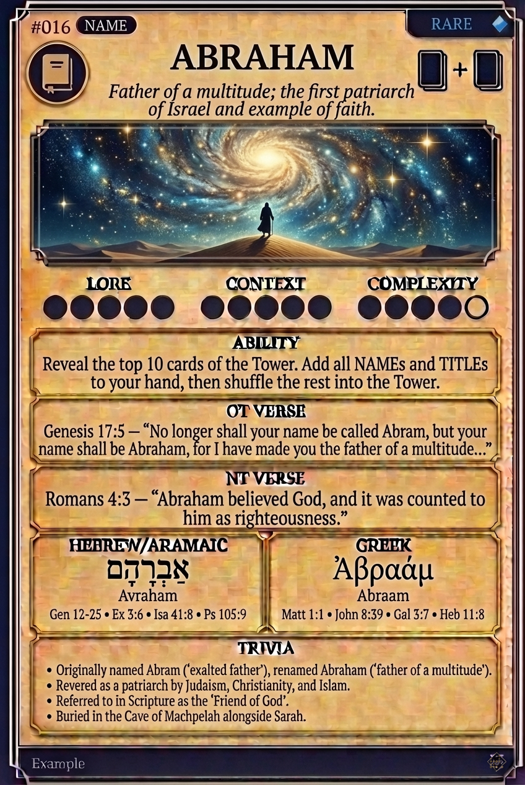

# Hypertext — ABRAHAM

## Word
**ABRAHAM** — Father of a multitude; the first patriarch of Israel and example of faith.

## Old Testament
> Genesis 17:5 — "No longer shall your name be called Abram, but your name shall be Abraham, for I have made you the father of a multitude..."

## New Testament
> Romans 4:3 — "Abraham believed God, and it was counted to him as righteousness."

## Trivia
- Originally named Abram ('exalted father'), renamed Abraham ('father of a multitude').
- Revered as a patriarch by Judaism, Christianity, and Islam.
- Referred to in Scripture as the 'Friend of God'.
- Buried in the Cave of Machpelah alongside Sarah.

