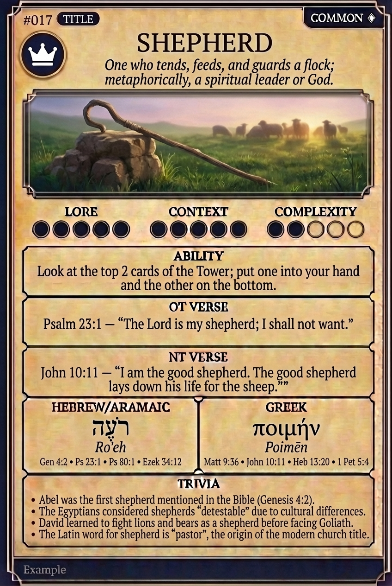

# Hypertext — SHEPHERD

## Word
**SHEPHERD** — One who tends, feeds, and guards a flock; metaphorically, a spiritual leader or God.

## Old Testament
> Psalm 23:1 — "The Lord is my shepherd; I shall not want."

## New Testament
> John 10:11 — "I am the good shepherd. The good shepherd lays down his life for the sheep."

## Trivia
- Abel was the first shepherd mentioned in the Bible (Genesis 4:2).
- The Egyptians considered shepherds 'detestable' due to cultural differences.
- David learned to fight lions and bears as a shepherd before facing Goliath.
- The Latin word for shepherd is 'pastor', the origin of the modern church title.

