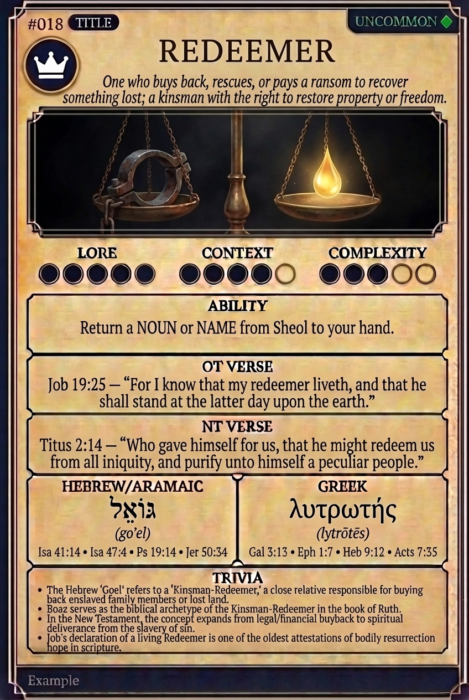

# Hypertext — REDEEMER

## Word
**REDEEMER** — One who buys back, rescues, or pays a ransom to recover something lost; a kinsman with the right to restore property or freedom.

## Old Testament
> Job 19:25 — "For I know that my redeemer liveth, and that he shall stand at the latter day upon the earth."

## New Testament
> Titus 2:14 — "Who gave himself for us, that he might redeem us from all iniquity, and purify unto himself a peculiar people."

## Trivia
- The Hebrew 'Goel' refers to a 'Kinsman-Redeemer,' a close relative responsible for buying back enslaved family members or lost land.
- Boaz serves as the biblical archetype of the Kinsman-Redeemer in the book of Ruth.
- In the New Testament, the concept expands from legal/financial buyback to spiritual deliverance from the slavery of sin.
- Job's declaration of a living Redeemer is one of the oldest attestations of bodily resurrection hope in scripture.

