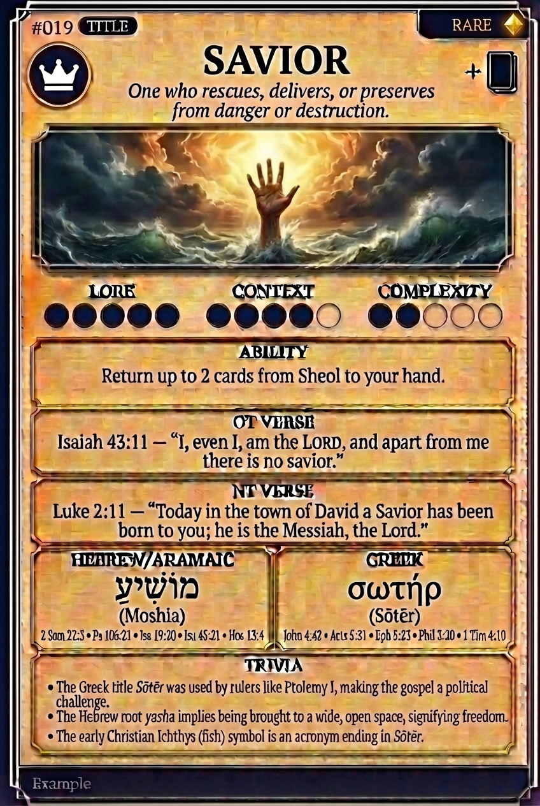

# Hypertext — SAVIOR

## Word
**SAVIOR** — One who rescues, delivers, or preserves from danger or destruction.

## Old Testament
> Isaiah 43:11 — "I, even I, am the LORD, and apart from me there is no savior."

## New Testament
> Luke 2:11 — "Today in the town of David a Savior has been born to you; he is the Messiah, the Lord."

## Trivia
- The Greek title Sōtēr was used by rulers like Ptolemy I, making the gospel a political challenge.
- The Hebrew root yasha implies being brought to a wide, open space, signifying freedom.
- The early Christian Ichthys (fish) symbol is an acronym ending in Sōtēr.

