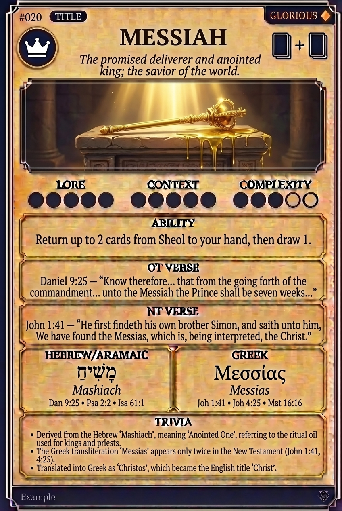

# Hypertext — MESSIAH

## Word
**MESSIAH** — The promised deliverer and anointed king; the savior of the world.

## Old Testament
> Daniel 9:25 — "Know therefore... that from the going forth of the commandment... unto the Messiah the Prince shall be seven weeks..."

## New Testament
> John 1:41 — "He first findeth his own brother Simon, and saith unto him, We have found the Messias, which is, being interpreted, the Christ."

## Trivia
- Derived from the Hebrew 'Mashiach', meaning 'Anointed One', referring to the ritual oil used for kings and priests.
- The Greek transliteration 'Messias' appears only twice in the New Testament (John 1:41, 4:25).
- Translated into Greek as 'Christos', which became the English title 'Christ'.

